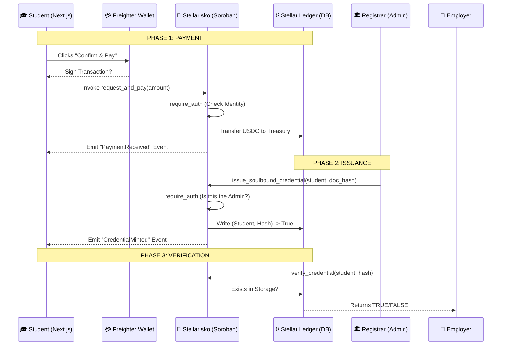

# 📊 StellarIsko: System Flow & Logic Breakdown

This document explains exactly how the "StellarIsko" machine works, from the moment a student clicks "Pay" in your Next.js app to the moment a permanent record is written to the blockchain.

---

## 1. The Visual Flow (Mermaid Diagram)

---

## 2. Deep Dive: What's Happening in the "Alien" Logic?

Let's translate the Rust code in `src/lib.rs` into **React/Next.js concepts**.

### 🛠️ The "Database Schema" (`DataKey`)
In a standard app, you'd use Prisma or Mongoose. In Soroban, we define a "Key" for every row in our database.
*   **`Admin`**: Think of this as your `ADMIN_WALLET_ID` in your `.env` file.
*   **`Treasury`**: This is the university's bank account address.
*   **`Credential(Address, Hash)`**: This is a **Composite Key**. It’s like a table where the primary key is a combination of the `student_id` and the `document_id`.

### 🏗️ The `initialize` Function
**Web Dev Analogy:** This is your `setup` or `seed` script. 
It runs **only once** when the contract is first deployed. It sets the "Environment Variables" for the contract so it knows which wallet is the Admin and where to send the money. If you try to run it again, it "panics" (throws an error), just like a `try/catch` block.

### 💳 The `request_and_pay` Function
**Web Dev Analogy:** This is a **POST request** to `/api/checkout`.
1.  **`require_auth()`**: This is your `getServerSession()`. It proves the student actually owns the wallet they are paying with.
2.  **`token::Client`**: This is the **Stripe SDK**. We tell the "Stripe SDK" (the USDC contract) to move money from the Student's wallet to the University's wallet.
3.  **`env.events().publish()`**: This is like a **Pusher or Socket.io broadcast**. It tells your React app "Hey! The payment was successful!" so you can show a success message.

### 📜 The `issue_soulbound_credential` Function
**Web Dev Analogy:** This is the **"Minting"** process. 
1.  The Admin (Registrar) logs in.
2.  They click a button that sends the student's address and a unique "Hash" (a digital fingerprint of the document) to the contract.
3.  **The Soulbound Magic:** Notice there is **no `transfer` function** in our code. In a normal token (like XLM), there is a function to send it to someone else. Because we didn't write one, once that `(Student, Hash)` record is written to the ledger, it is **stuck there forever.** It is "Soulbound" to that wallet.

### 🔍 The `verify_credential` Function
**Web Dev Analogy:** This is a **GET request** to `/api/verify`.
It doesn't cost any "gas" (money) to run because it's just reading data. It looks into the ledger and says: *"Does a record exist for this student and this document hash?"* 
*   If **Yes**: Returns `true` (The document is real).
*   If **No**: Returns `false` (The document is fake).

---

## 3. Why is this better than a normal database?
If PUP uses a SQL database, a hacker could theoretically change a grade or a payment record. 
With **StellarIsko**, because the logic is in a **Smart Contract**:
1.  **Immutability:** No one—not even the Admin—can "delete" a payment record once it's on Stellar.
2.  **Transparency:** Anyone can verify a document without calling the PUP registrar's office.
3.  **Speed:** You get your document in 5 seconds, not 3 days.
